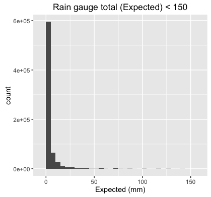
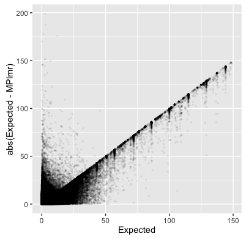

### Objective: predict the amount of rain based on weather radar measurements. 

*** 

#### Some Context:

- Rainfall is highly variable across space and time and hence tricky to measure

- Rain-gauges are highly effective but we cant have them everywhere; its not practical

- Weather radars can give us this rainfall information across large areas but predictions based on them 
do not always agree with the rain observed by the rain-guages. 

- Radar measurements give us instantaneous values of rainfall rate but rain gauges give us the cumulative sum of the rainfall over periods of time. 

- Polarimetric doppler radars are supposedly good at measureing dropsizes and hence giveing a better estimate of the amount rainfall. Weather radars are interesting, check out the [Wikipedia article](https://en.wikipedia.org/wiki/Weather_radar) for more on them if you are curious.


***
#### A glimpse of the raw data set 

```{r, echo=FALSE, message=FALSE, background='#FFFF00', message=F, warning=F, results='hide'}
library(dplyr)
library(data.table)
library(ggplot2)
library(xgboost)
library(knitr)


# load train.csv 
train <- fread('/Users/workhorse2/Documents/Meetup_Competetions/How_much_did_it_rain_II/raw_data/train.csv')
train <- as.data.frame(train)
```

```{r, echo=FALSE, message=FALSE, background='#FFFF00', message=F, warning=F}
# print a snapshot of the training set
knitr::kable(head(train,15))
```

***

#### A more concrete problem statement:

Predict the amount of as rain measured by the rain gauges (in 'mm') over a period of one hour, given instantaneous radar measurements (and derived quantities) at different instances over that hour. 

#### Some notes about the data set

- The competetion admin notes that "Essentially radar measures instantaneous rain rate and the gauge measures hourly total. It is safe to assume that if the radar observations are nans, then the rainrate at that instant in time is zero. But an hour where 40% of the observations are nan could have had some rain." Clarifies in a later comment saying he means the "Ref" column. 

- There are extreme outliers in the target value coming from clogged/not working  rain-gauges. People tried different threshold values  "50 - 100 mm" and many settled close to 70 mm. Not sure if there were any specific theshold or rows that were suggested to be left out by the admin. 

- The number or radar sweeps for each Id is not the same. Hence we need to somehow collapse this information in to one record per Id. 

- The training data has been collected over 20 days each month during corn growing season in US. The test data is form the rest of the 10/11 days of those months. Location and time information has been censored. This means any two records can be correlated and CV or validation split will not be as effective.

*** 
#### Pre-processing (preparing dataset for model training)

- Remove rows where "Ref" is NA

- Remove records with "Expected" (rain gauge reading) > 150 mm. Chose to be more conservative for the first attempt. These are close ~1% of total rows. 

- Calculate rainfall rate estimate based on [Marshall-Palmer relation](http://glossary.ametsoc.org/wiki/Marshall-palmer_relation) (i.e. Z = 200*(R)^1.6, where Z is reflectivity and R is rainfall rate). This is also the benchmark.

- Calculate time differences between readings to use as the amount of each time radar measurement was valid. Used for other "Ref" features, particularly Ref_5x5_50th, RefComposite, RefComposite and RefComposite_5x5_50th. These features were simply mean(Ref_feature * time_differnce), where the Ref_feature was converted back from decibel to original units. 

- Other features were created:  mean(RhoHV), mean(radardist_km) in each record,  the number of NA's in original record and number of measurements in each record.  


```{r, echo=FALSE, message=FALSE, background='#FFFF00' , eval=FALSE}

# remove rows where "Ref" is NA
train_raw_tmp <- train[!is.na(train[,"Ref"]),]  

### Marshall palmer script by Mlandry - Kaggle Scripts 

mpalmer <- function(ref, minutes_past) {
  
  # order reflectivity values and minutes_past
  sort_min_index = order(minutes_past)
  minutes_past <- minutes_past[sort_min_index]
  ref <- ref[sort_min_index]
  
  # calculate the length of time for which each reflectivity value is valid
  valid_time <- rep(0, length(minutes_past))
  valid_time[1] <- minutes_past[1]
  if (length(valid_time) > 1) {
    for (i in seq(2, length(minutes_past))) {
      valid_time[i] <- minutes_past[i] - minutes_past[i-1]
    }
    valid_time[length(valid_time)] = valid_time[length(valid_time)] + 60 - sum(valid_time)
  } else {
    # if only 1 observation, make it valid for the entire hour
    valid_time <- 60
  }
  
  valid_time = valid_time / 60
  
  # calculate hourly rain rates using marshall-palmer weighted by valid times
  sum <- 0
  for (i in seq(length(ref))) {
    if (!is.na(ref[i])) {
      mmperhr <- ((10^(ref[i]/10))/200) ^ 0.625
      sum <- sum + mmperhr * valid_time[i]
    }
  }
  
  return(sum)
  
}

results <- train_raw_tmp %>% group_by(Id) %>% summarize(MPlmr=mpalmer(Ref, minutes_past))
train_raw_tmp <- merge(train_raw_tmp,results,by = "Id")

# Another function to calculate time difference

time_difference <- function(times, num_per_segment = 60) {
  n <- length(times)
  valid_time <- vector(mode="numeric", length = n)
  valid_time[1] <- times[1]
  valid_time[-1] <- diff(times, 1)
  valid_time[n] <- valid_time[n] + num_per_segment - sum(valid_time)
  valid_time <- valid_time / num_per_segment
  valid_time
}

## Calculate time differences for now fearures. 

# Order training data by Id and minutes_past 
tmp <- train_raw_tmp[order( train_raw_tmp$Id,train_raw_tmp$minutes_past),] 

# calculate time differences for 
chk <- tmp %>% group_by(Id) %>% do(tdiff = time_difference(.$minutes_past))

#  check if any negative values crept in.
any(unlist(lapply(chk$tdiff , function(x) {x < 0})));

# check if the these Id's match the tmp. 
  all(rep(chk$Id, unlist(lapply(chk$tdiff , function(x) {length(x)})))==tmp$Id);   # YES!
  
# add the tdiff vector to tmp and call it valid_time
  tmp$valid_time <- unlist(chk$tdiff)

# Now use the valid time to define new features
  
  num_readings <- unlist(lapply(chk$tdiff , function(x) {length(x)}))
  num_nas <-  apply(tmp, 1 ,function(x){sum(is.na(x))})  # this is not useful here - do it for final dataset. 
  
   tmp <- tmp %>%  mutate(Ref_5x5_tpd = 10^(Ref_5x5_50th/10)*valid_time, 
                  Ref_composite_tpd = 10^(RefComposite/10)*valid_time,
                  RefComposite_5x5_tpd  = 10^(RefComposite_5x5_50th/10)*valid_time)
   
   tmp <- tmp %>% mutate(num_nas = num_nas)
  
  #Collapse to one record per Id - Just taking mean although in most cases I am just loading the unique value
  
    train_final <- tmp  %>% group_by(Id) %>% summarize(Expected = mean(Expected, na.rm = T), 
                                               MPlmr = mean(MPlmr, na.rm = T), 
                                               Ref = mean(10^(Ref/10), na.rm = T),
                                               Ref_5x5_tpd = mean(Ref_5x5_tpd, na.rm = T),
                                               Ref_composite_tpd = mean(Ref_composite_tpd, na.rm = T),
                                               RefComposite_5x5_tpd = mean(RefComposite_5x5_tpd, na.rm = T),
                                               num_nas = sum(num_nas),
                                               radardist = mean(radardist_km, na.rm = T),
                                               RhoHV = mean(RhoHV, na.rm = T))
      
    train_final <- train_final %>% mutate(num_readings = num_readings)


```

- Remove all rows with Expected > 150 mm. Lets look at the rain gauge values ("Expected" column) in the training set which are < 150 mm. 

|   |
|-----------------------------|
|Figure. Most of the rain gauge readings are  < 50 mm.|


- The marshall palmer predictions (benchmark) are noisy at low rain gauge readings.

|   |
|-----------------------------|
|Figure. Comparing the Marshall palmer predictions with observed rain gauge readings.|


```{r, echo=FALSE, message=FALSE, background='#FFFF00', eval=FALSE}
#**NOTE: THIS CHUNK IS NOT EVALUATED BY DEFAULT - SET eval = TRUE

# Look at rain gauge totals in the dataset < 150 mm. 
    ggplot(train_final %>% filter(Expected  < 150), aes(x = Expected)) + geom_histogram() + 
      labs(title = "Rain gauge total (Expected) < 150", x = "Expected (mm)")
```

 
```{r, echo=FALSE, message=FALSE, background='#FFFF00', eval= FALSE} 
#**NOTE: THIS CHUNK IS NOT EVALUATED BY DEFAULT - SET eval = TRUE

# Number of outliers ??
    sum(train_final$Expected > 70)
    sum(train_final$Expected >  150)
    
    sum(train_final$Expected > 150)/nrow(train_final)
    sum(train_final$Expected > 70)/nrow(train_final)
    
    
# Remove all values above 150mm  
    
    train_final <- train_final %>% filter(Expected < 150)
    
# look at how many Na's still remain
    lapply(train_final, function(x){sum(is.na(x)) }) 

```

- Create test and validation sets based on a 70/30 split. Implement a basic stratified sampling over the variable "number of records per Id". Pick equally from all teh quantiles of this variable to generate the training set - rest is the validation set. 

```{r, echo=FALSE, message=FALSE, background='#FFFF00', eval= FALSE}
#**NOTE: THIS CHUNK IS NOT EVALUATED BY DEFAULT - SET eval = TRUE

# Create training and validation sets
    
    
    strat<- data.frame( fact  = cut(train_final$Expected, breaks = quantile(train_final$Expected) , 
        labels = c("q1","q2", "q3","q4"), include.lowest = TRUE), 
        idx =  1:length(train_final$Expected) )
    
    # doing a ~ 70:30 split -- 503156 in training set, 215642 in validation set. 
    # i.e. 125789 from each quantile
    
    q1Id <- strat %>% filter(fact=="q1") %>% select(idx)
    q2Id <- strat %>% filter(fact=="q2") %>% select(idx)
    q3Id <- strat %>% filter(fact=="q3") %>% select(idx)
    q4Id <- strat %>% filter(fact=="q4") %>% select(idx)
    
    train_ids <- c( q1Id[sample(nrow(q1Id), 125789),], 
                    q2Id[sample(nrow(q2Id), 125789),],
                    q3Id[sample(nrow(q3Id), 125789),],
                    q4Id[sample(nrow(q4Id), 125789),])
    valid_ids <- strat$idx[-train_ids]
    
    rm(q1Id, q2Id,q3Id,q4Id)
    
    train_df <- train_final[train_ids,]
    valid_df <- train_final[-train_ids,]
```

- Train xgboost model with following parameters. 

                   "objective"  = "reg:linear" 
                   , "eval_metric" = "rmse"
                   , "eta" = 0.01
                   , "min_child_weight" = 20    
                   , "max_depth" = 4
                   , "nthreads" = 2
                   , "nrounds" = 400

```{r, echo=FALSE, message=FALSE, background='#FFFF00', eval= FALSE}   
# Model training 
    
  # Edited parameters here to try something different

    param0 <- list("objective"  = "reg:linear" 
                   , "eval_metric" = "rmse"
                   , "eta" = 0.3
                   , "min_child_weight" = 5    
                   , "max_depth" = 4
                   , "nthreads" = 2
    )
    
    xgtrain = xgb.DMatrix(as.matrix(train_df %>% select(-Expected)), label = train_df$Expected, missing = NA)
    xgvalid = xgb.DMatrix(as.matrix(valid_df %>% select(-Expected)), label = valid_df$Expected, missing = NA)
    rm(train_final,train_ids,valid_ids)
    gc()
    
    
    watchlist <- watchlist <- list(train=xgtrain, test=xgvalid)
    xgt_mod1  <- xgb.train(params = param0, data = xgtrain , nrounds =1000, verbose = 1, print.every.n = 20, 
                           watchlist = watchlist)
    
    pr  <- predict(xgt_mod1,xgvalid)
```


```{r, echo=FALSE, message=FALSE, background='#FFFF00', eval= FALSE}  


## pre-process test set in the same way 
    
    test <- fread('raw_data/test.csv')
    str(test)
    test <- as.data.frame(test)
    # test_raw_tmp <- test[!is.na(test[,"Ref"]),]  ## Skip this in the test set ?
    
    test_raw_tmp <- test
    
    results <- test_raw_tmp %>% group_by(Id) %>% summarize(MPlmr=mpalmer(Ref, minutes_past))
    str(results)
    test_raw_tmp <- merge(test_raw_tmp,results,by = "Id")
    tmp <- test_raw_tmp[order( test_raw_tmp$Id, test_raw_tmp$minutes_past),] 
  
    chk <- tmp %>% group_by(Id) %>% do(tdiff = time_difference(.$minutes_past))
    
    
    #unlist(lapply(chk$tdiff , function(x) {x < 0}))
    any(unlist(lapply(chk$tdiff , function(x) {x < 0})))
    
    
    # check if the these Id's match the tmp. 
    all(rep(chk$Id, unlist(lapply(chk$tdiff , function(x) {length(x)})))==tmp$Id)   # YES!
    
    # add the tdiff vector to tmp and call it valid_time
    tmp$valid_time <- unlist(chk$tdiff)
    
    # Now use the valid time to define new features
    
    num_readings <- unlist(lapply(chk$tdiff , function(x) {length(x)}))
    num_nas <-  apply(tmp, 1 ,function(x){sum(is.na(x))})  
    
    tmp <- tmp %>%  mutate(Ref_5x5_tpd = 10^(Ref_5x5_50th/10)*valid_time, 
                           Ref_composite_tpd = 10^(RefComposite/10)*valid_time,
                           RefComposite_5x5_tpd  = 10^(RefComposite/10)*valid_time)
    
    tmp <- tmp %>% mutate(num_nas = num_nas)

    
    #Collapse to one record per Id - Just taking mean although in most cases I am just loading the unique value
    
    test_final <- tmp  %>% group_by(Id) %>% summarize( MPlmr = mean(MPlmr, na.rm = T), 
                                                       Ref = mean(10^(Ref/10), na.rm = T),
                                                       Ref_5x5_tpd = mean(Ref_5x5_tpd, na.rm = T),
                                                       Ref_composite_tpd = mean(Ref_composite_tpd, na.rm = T),
                                                       RefComposite_5x5_tpd = mean(RefComposite_5x5_tpd, na.rm = T),
                                                       num_nas = sum(num_nas),
                                                       radardist = mean(radardist_km, na.rm = T),
                                                       RhoHV = mean(RhoHV, na.rm = T))
    
    test_final <- test_final %>% mutate(num_readings = num_readings)
    
  
    
    xgtest = xgb.DMatrix(as.matrix(test_final), missing = NA)
   
    
    pr  <- predict(xgt_mod1,xgtest)
    
    save(test_final, xgtest, pr ,file = "temp/test_results_xgboost.Rdata")
    
    ######## WRITE SOLUTION TO FILE
    
    sample_sol <-fread("./raw_data/sample_solution.csv")
    
    res <- data.frame(
      Id = test_final$Id,
      Expected =  pr 
    )
    
    #convert expected values to 0.01in values
    res$Expected <- round(res$Expected / 0.254) * 0.254
    
    summary(res)
    
    write.csv(res, "Submissions/xgb_sub1.csv", row.names = FALSE, col.names = TRUE)
    
    ####
```    


- Made a submission with that model but it seems to be doing worse than the benchmark. Since the Marshall palmer values are also included as a feature this is somewhat surprising. So I suspect there is a bug somewhere.   

***
#### Let's at the winning solution:

- The winner of this competetion used recurrent neural nets (RNN) and had some pretty interesting ideas. Here is [link to his blog post](http://simaaron.github.io/Estimating-rainfall-from-weather-radar-readings-using-recurrent-neural-networks/) about this competetion. 
    
***
##### What are RNNs? A brief description of the idea.  

- Traditional neural nets: 
    - Feed-forward nets. Use Backpropagation algorithm for training.  

|   |
|-----------------------------|
|Figure. Standard feed-forward neural net. Source: wikipedia|


- Recurrent neural nets: 
    - Have delayed outputs of hidden layer looping back on them, i.e. delayed by a time step or a training instance. 
    - Backpropagation can also be used to train RNN's but it just gets a litte more complicated. 
    
    
|   |
|-----------------------------|
|Figure. Recurrent neural net has delayed outputs from the hidden layer as additional inputs to the hidden layer.  Source: wikibooks.org|


|   |
|-----------------------------|
|Figure. An unrolled picture of a recurrent neural net makes the sequential behaviour clear. Source: [Cristopher Olah's blog](http://colah.github.io/posts/2015-08-Understanding-LSTMs/) |

***
A few remarks about his approach:

-  Recognized that each record (Id) has a sequence of measurements. The structure is similar to the toy adding problem: a key insight. 

- Did not implement an new features and tried to design a end-to-end learning framework. 

- Tried validation with stratified sampling but relied on the public leaderboard scores in the end since examples are correlated and he found that his models were severely overfitting. 

- Implemented drop-in data-augmentation. This he believes makes the network to account for the time-intervals between observations. (I don't have a good feeling for this).

- Stacked several hidden layers and sandwiched them between dense layers. Averaged the output of the dense layers in the final layer to get  the output. 

- Used mini-batch stochastic gradient descent (SGD) to train the model with batches of 64 sequences (records).

- The winning submission used a simple weighted average of 30 separate models. His best single model scored  23.6971 on public leaderboard. There seems to be not much about how these models difffered from each other. 

***

###### A few things to try next:

- Include other features like zDR and KDp etc. More accurate rainfall rate estimators are described [here](https://www.eol.ucar.edu/projects/dynamo/spol/parameters/rain_rate/rain_rates.html)

- Use MAE instead of RMSE for optimizing. 

- Ignore values with negative reflectivity values?

- Use a smaller threshold, maybe 70 mm. 

- Of course try implementing an RNN model. 


###### A few more useful links on RNN's:

- [Chistopher Olah's blog](http://colah.github.io/posts/2015-08-Understanding-LSTMs/)

- [WildML](http://www.wildml.com/2015/09/recurrent-neural-networks-tutorial-part-1-introduction-to-rnns/)

- [Stanford CS224 lecture notes on RNN's for NLP](http://cs224d.stanford.edu/lecture_notes/notes4.pdf)

- [Andrej Karpathy's blog](http://karpathy.github.io/2015/05/21/rnn-effectiveness/)


